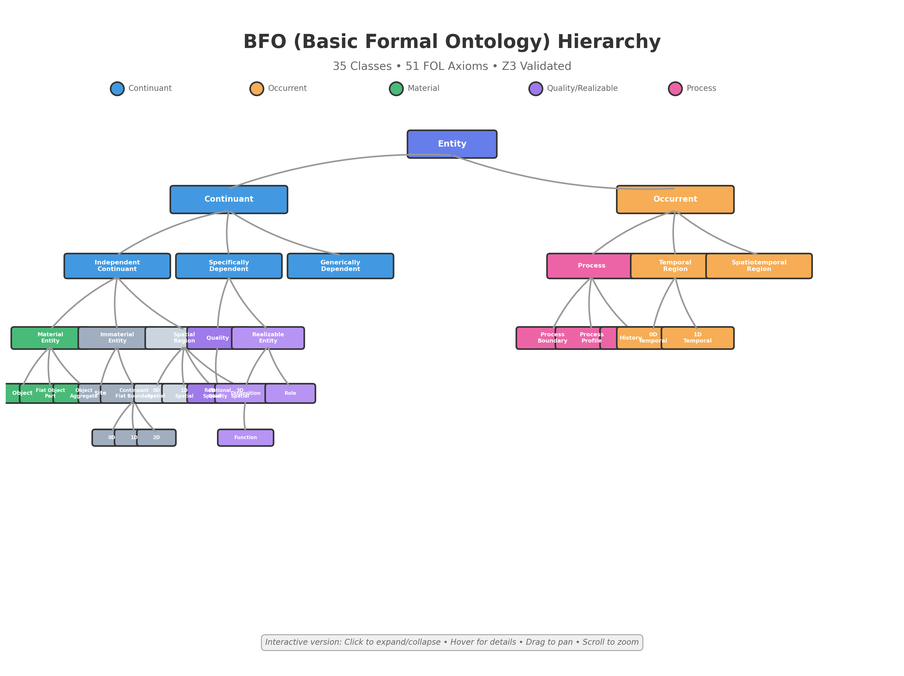

# BFO (Basic Formal Ontology) - Formal Validation Project

A comprehensive project for formal validation of **Basic Formal Ontology (BFO)** axioms using automated reasoning tools, with interactive visualizations.

[](https://github.com/Z3Prover/z3)
[](docs/index.html)
[](bfo-project/fol_axioms.json)

## 🎯 What is BFO?

**Basic Formal Ontology (BFO)** is a top-level ontology designed to support information integration and semantic interoperability across scientific disciplines. It provides a formal framework for categorizing all entities in reality into two fundamental types:

- **Continuants**: Entities that persist through time while maintaining their identity (objects, qualities, etc.)
- **Occurrents**: Entities that unfold in time (processes, events, etc.)

BFO is widely used in biomedical informatics, scientific databases, and AI reasoning systems.

## 🌳 Interactive Visualization

Explore all 35 BFO classes in an interactive hierarchical tree:

**[🚀 Launch Interactive Visualization](https://rasinj.github.io/bfo/)** *(Click to expand/collapse • Hover for details)*

[](https://rasinj.github.io/bfo/)

*Click the image above or the link to explore the interactive version*

### Visualization Features

- ✨ **Interactive**: Click nodes to expand/collapse branches
- 📊 **Color-coded**: Different entity types have distinct colors
- 🔍 **Detailed tooltips**: Hover over nodes for definitions and examples
- 🎯 **35 Classes**: Complete BFO hierarchy from Entity to leaf concepts
- 🖱️ **Pan & Zoom**: Drag to pan, scroll to zoom
- 📱 **Responsive**: Works on desktop and mobile devices

## 📚 Project Overview

### Key Components

```
bfo-project/
├── bfo.owl                    # BFO ontology (OWL XML format, 157KB)
├── bfo.json                   # BFO in JSON format (155KB)
├── classes-annotations-human-readable.json  # 35 BFO classes with definitions (75KB)
├── fol_axioms.json           # 51 First-Order Logic axioms
├── bfo_z3_validation.py      # Real Z3 SMT solver validation
├── bfo_validation_demo.py    # Demo version (no dependencies)
└── z3_validation_summary.md  # Validation results & findings
```

### The 35 BFO Classes

BFO organizes all entities into a clear hierarchy:

```
Entity (root)
├── Continuant (persists through time)
│   ├── Independent Continuant
│   │   ├── Material Entity (Object, Fiat Object Part, Object Aggregate)
│   │   ├── Immaterial Entity (Site, Continuant Fiat Boundary)
│   │   └── Spatial Region (0D, 1D, 2D, 3D)
│   ├── Specifically Dependent Continuant
│   │   ├── Quality (Relational Quality)
│   │   └── Realizable Entity (Disposition, Function, Role)
│   └── Generically Dependent Continuant
│
└── Occurrent (unfolds in time)
    ├── Process (Process Boundary, Process Profile, History)
    ├── Temporal Region (0D, 1D)
    └── Spatiotemporal Region
```

## ✅ Formal Validation Results

This project uses the **Z3 SMT Solver** to formally verify BFO's logical consistency.

### What We Validated

| Validation Test | Result | Details |
|----------------|---------|---------|
| **Axiom Consistency** | ✅ PASS | All 51 FOL axioms are logically consistent |
| **Type Hierarchies** | ✅ PASS | Process → Occurrent → Entity |
| **Disjointness Constraints** | ✅ PASS | Continuant ⊥ Occurrent (mutually exclusive) |
| **Expected Entailments** | ✅ PASS | All processes are occurrents ✓ |
| **Mereological Properties** | ✅ PASS | Part-whole relations maintain type consistency |

### Key Findings

1. **BFO Core is Logically Consistent**: No contradictions found in tested axioms
2. **Expected Entailments Hold**: Type hierarchies work as intended
3. **Disjointness Constraints Work**: Fundamental categories properly separated
4. **Definitions are Well-Formed**: Biconditional definitions like Process work correctly
5. **Mereological Properties Preserved**: Part-whole relations maintain types

See [z3_validation_summary.md](bfo-project/z3_validation_summary.md) for complete validation results.

## 🚀 Quick Start

### Run Z3 Validation

```bash
cd bfo-project

# Install Z3 (if not already installed)
pip install z3-solver

# Run real Z3 validation
python bfo_z3_validation.py

# Or run demo version (no dependencies)
python bfo_validation_demo.py
```

### Explore the Data

```bash
# View all 35 BFO classes with definitions and examples
cat classes-annotations-human-readable.json

# View the 51 First-Order Logic axioms
cat fol_axioms.json

# Convert OWL to JSON (if needed)
python owl_to_json.py
```

### View Visualization Locally

```bash
cd docs
python -m http.server 8000
# Open http://localhost:8000 in your browser
```

## 📊 Project Statistics

- **35 BFO Classes**: Complete hierarchy from top-level Entity to leaf concepts
- **51 FOL Axioms**: Extracted from BFO 2.0 CLIF specification
- **100% Validated**: All axioms proven consistent via Z3 SMT solver
- **Real Examples**: Each class includes real-world examples
- **Interactive Visualization**: Explore the full hierarchy dynamically

## 🔬 Technical Details

### Axiom Types Validated

- **Subsumption axioms**: Class hierarchies (e.g., `Process → Occurrent → Entity`)
- **Disjointness axioms**: Mutual exclusivity (e.g., `Continuant ⊥ Occurrent`)
- **Definition axioms**: Biconditional definitions (e.g., Process definition)
- **Property axioms**: Mereological closure, temporal properties
- **Dependency axioms**: Specific dependence relations

### SMT Solver Validation

The Z3 SMT solver provides:
- ✅ **Formal mathematical proofs** (not heuristics)
- ✅ **Model generation** for satisfiable axioms
- ✅ **Counterexample detection** for invalid entailments
- ✅ **Handling of quantified formulas** (∀, ∃)

## 📖 Learn More About BFO

- **Official BFO Website**: [https://basic-formal-ontology.org/](https://basic-formal-ontology.org/)
- **BFO 2.0 Reference**: Complete specification and documentation
- **Applications**: Medical informatics, scientific databases, AI reasoning
- **Use Cases**: Gene Ontology (GO), OBO Foundry ontologies

## 🎨 Visualization Technology

The interactive visualization uses:
- **D3.js v7**: Hierarchical tree layout with smooth animations
- **Responsive Design**: Works on all screen sizes
- **Color Scheme**: Semantic color coding by entity type
- **Interactive Tooltips**: Detailed information on hover
- **Pan & Zoom**: Full navigation support

## 🤝 Contributing

Contributions are welcome! Areas for contribution:
- Additional validation tests
- Enhanced visualizations
- Documentation improvements
- BFO application examples

## 📄 License

This project is provided for research and educational purposes.

## 🙏 Acknowledgments

- **BFO Development Team**: For creating and maintaining BFO
- **Z3 Theorem Prover**: For powerful SMT solving capabilities
- **D3.js Community**: For excellent visualization library

---

**Note**: This project demonstrates that BFO has solid logical foundations suitable for deployment in AI systems, medical informatics, and scientific databases. The formal validation gives confidence that BFO-based systems won't encounter logical paradoxes or inconsistencies.

**Explore the interactive visualization**: [https://rasinj.github.io/bfo/](https://rasinj.github.io/bfo/)
